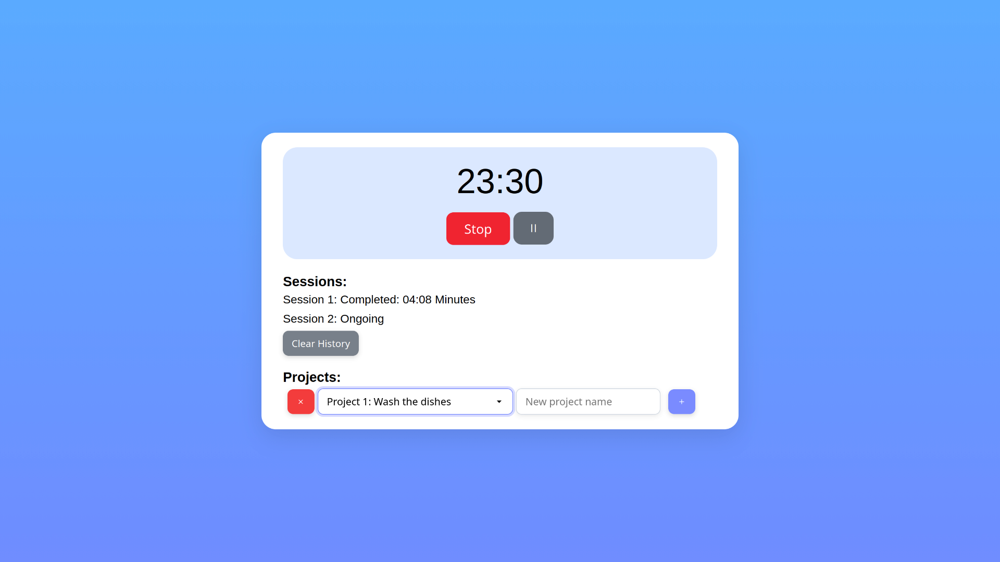

# Light Pomodoro

Light Pomodoro is a lightweight full-stack Pomodoro timer application built with vanilla JavaScript on the frontend and Node.js + TypeScript on the backend.
It focuses on clarity and simplicity, keeping most of the dynamic logic on the client side while the backend provides persistence and session bookkeeping.



## Overview

Users can start Pomodoro sessions, pause them, resume them, and stop them.
The client is responsible for running the actual timer, while the backend stores session metadata and pause history in MongoDB.

This design keeps the project “light” and avoids unnecessary overhead or real-time infrastructure.

## Running Light Pomodoro Locally

Follow these steps to run the project on your machine (frontend + backend):

### 1. Clone the Repository

```bash
git clone https://github.com/ammar-elmesaly/Light-Pomodoro.git
cd Light-Pomodoro
```

### 2. Install Backend Dependencies

The backend is in Node.js + TypeScript.

```bash
cd server
npm install
```

### 3. Environment Variables

Create a .env file inside the server directory and add:

`MONGO_URI=your_mongodb_connection_string`

### 4. Start the Backend Server

```bash
npm run start:dev
```

This runs on `http://localhost:3000` (by default).

### 5. Install Frontend Dependencies

```bash
cd ../client
npm install
```

### 6. Start the Frontend

```bash
npm run start:dev
```

This runs on `http://localhost:5173` (by default).

### 7. Open the App

Visit: `http://localhost:5173`

## How It Works

### 1. Starting a Session

When the user starts a session:

* The frontend sends a POST /session/start request to the backend.
* The backend creates a new session entry with the start timestamp.
* After receiving the response, the client starts its own setInterval loop to run the countdown.

### 2. Timer Handling (Client-Side)

The timer is entirely managed on the frontend.

The backend:

* does not run intervals
* does not track countdowns
* only stores timestamps and pause events

If the user refreshes the page:

* The frontend asks the backend for any active or paused session.
* If one exists, the client calculates the remaining time using timestamps stored in the database.
* The client recreates its local countdown using setInterval.

### 3. Pausing & Resuming

When pausing:

* The frontend sends a POST /session/pause.
* The backend records the pause start.
* When resuming, it records the pause end.
* Pauses are stored as { start, end } objects in an array.

### 4. Stopping the Session

When the user stops the session:

* The frontend sends a POST /session/stop.
* The backend computes:
`duration = endTime - startTime - totalPauseDuration`

It then stores the final completed session in MongoDB.

### Session Data & State

The backend stores only metadata, not the timer state.
The true state (running, paused, remaining seconds, interval ID, etc.) lives on the client.

Client stores:

* the actual ticking timer
* interval ID
* remaining time
* local UI state

This makes the architecture simple and avoids backend intervals.

## Possible Improvements

### Make the backend aware of the intended session duration

Currently, small variations can occur due to network latency or refresh timing.
Storing the planned session length (e.g., 25 minutes) would allow perfect accuracy.

### Optional WebSocket-based syncing

The backend could emit a tick to clients once per second.
This would:

* ensure perfect consistency
* reduce client responsibility
* But it would no longer be “light.”

### Multi-user support

Sessions could be linked to user accounts or tokens.

## Purpose of the Project

Light Pomodoro is primarily a learning project aimed at exploring:

* full-stack architecture
* REST API design
* real-time-ish behavior without real-time infra
* client/server state coordination
* MongoDB data modeling

Feedback and suggestions are welcome!
